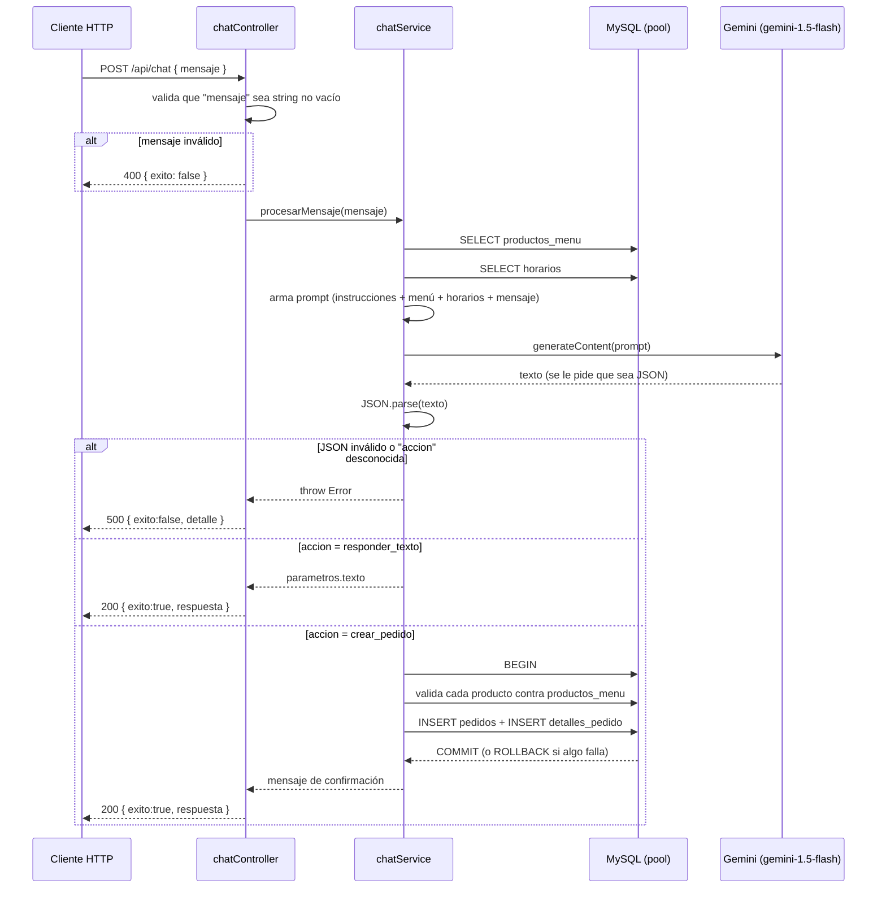

# PizzaBot / NonaBot

Chatbot para toma de pedidos de una pizzería ("La Nona"), que usa la API de Gemini para interpretar mensajes en lenguaje natural, devolver una acción estructurada (responder texto o crear un pedido) y persistirlo en MySQL. Resuelve el problema de automatizar la toma de pedidos por texto sin un flujo de botones/formulario rígido, delegando en el LLM la extracción de productos, cantidades y método de pago a partir de una consulta al menú y los horarios en base de datos.

> Nota de honestidad: el repo tiene dos partes que **hoy no están conectadas entre sí** (ver sección 6). Este README describe lo que el código realmente hace, no el objetivo final del producto.

## 1. Stack

Son dos proyectos Node independientes, cada uno con su propio `package.json`.

**Backend (`private/`)** — Express + Gemini + MySQL:
- `express` `^5.1.0`
- `@google/generative-ai` `^0.24.1` (modelo `gemini-1.5-flash`, hardcodeado en `private/config/gemini.js`)
- `mysql2` `^3.15.2`
- `dotenv` `^17.2.3`

**Frontend (raíz)** — Next.js con shadcn/ui:
- `next` `15.5.6`, `react` `19.2.0`, `react-dom` `19.2.0`
- `typescript` `^5`
- `tailwindcss` `^4.1.9`
- Componentes Radix UI (`@radix-ui/react-*`) vía shadcn/ui, `lucide-react` `^0.454.0`
- `zod` `3.25.76`, `react-hook-form` `^7.60.0` (instalados como parte del boilerplate de shadcn, no hay formularios que los usen en el chat)
- `@vercel/analytics` `1.3.1`

## 2. Cómo funciona (flujo real, backend)

El diagrama muestra el único flujo conversacional implementado: el endpoint `POST /api/chat`. El frontend de Next.js **no** dispara este endpoint (ver sección 6) — esto es lo que pasa si le pegás al backend directamente.



Cada request es independiente: no hay sesión de usuario, cookie ni ID de conversación. `procesarMensaje` recibe únicamente el mensaje actual (`private/services/chatService.js:146`).

## 3. Decisiones técnicas

### 3.1. Contexto de la conversación: no existe

**Problema:** un pedido real requiere varios turnos ("quiero una muzza" → bot pregunta tamaño → usuario responde "grande").

**Lo implementado:** cada llamada a `generateContent` manda un único turno `role: "user"` con el prompt de instrucciones + menú + horarios + el mensaje actual (`chatService.js:103-116`). No se usa `startChat`/historial de la SDK de Gemini, no se guarda el historial en memoria, sesión ni base de datos. `procesarMensaje(mensajeUsuario)` no recibe ni conserva nada de mensajes anteriores.

**Trade-off:** el endpoint queda stateless y trivial de escalar (no hay que gestionar expiración de sesión ni memoria por usuario), pero rompe el caso de uso central del producto: si el bot responde "¿me confirmás la dirección?" y el usuario contesta "Av. Siempreviva 742" en el siguiente request, el modelo no tiene forma de saber a qué pregunta corresponde esa respuesta, porque no recibe el turno anterior. El multi-turno solo funciona si el usuario carga todo en un solo mensaje.

### 3.2. Cuando el modelo no devuelve lo esperado: error genérico, no reintento

**Problema:** se le exige al modelo por prompt ("Tu respuesta DEBE SER SIEMPRE un objeto JSON válido") que devuelva `{ accion, parametros }`, pero es texto generado, no una respuesta estructurada garantizada por la API.

**Lo implementado:** no se usa `generationConfig.responseMimeType`/`responseSchema` ni function calling de la SDK de Gemini (ambos disponibles en `@google/generative-ai` `^0.24.1`) para forzar el formato. Se confía en el prompt y se hace `JSON.parse` manual envuelto en `try/catch` (`chatService.js:157-164`). Si el parseo falla, o si `accion` no matchea `"responder_texto"` / `"crear_pedido"` en el `switch`, se lanza un `Error` genérico que sube hasta `chatController`, que responde `500` con `{ exito:false, mensaje, detalle: error.message }` (`chatController.js:24-32`).

**Trade-off:** menos acoplamiento a features específicas de la API de Gemini y prompt más simple de leer, pero es frágil: cualquier desvío del modelo (texto explicativo antes del JSON, code fences de markdown, una acción mal escrita) termina en un 500 sin reintento ni fallback conversacional — el usuario ve un error técnico en vez de que el bot repregunte.

### 3.3. Persistencia del pedido: SQL crudo con transacción manual, sin ORM

**Problema:** crear un pedido implica escribir en dos tablas (`pedidos` y `detalles_pedido`) y validar contra `productos_menu` que cada producto exista, de forma atómica.

**Lo implementado:** `guardarPedidoEnBaseDatos` usa `pool.getConnection()` + `beginTransaction()/commit()/rollback()` de `mysql2` directamente, con queries parametrizadas a mano (`chatService.js:194-292`). No hay ORM (Prisma, Sequelize, etc.) ni capa de modelos, y no hay archivos de schema/migraciones en el repo.

**Trade-off:** cero dependencias extra y control total sobre las queries, pero la lógica de conexión/rollback se repite a mano en cada operación que toque más de una tabla, y al no haber migraciones versionadas, el schema de `productos_menu`, `horarios`, `pedidos` y `detalles_pedido` solo existe como conocimiento implícito en las queries — no hay forma de recrear la base desde el repo.

## 4. Cómo correrlo localmente

Son dos servidores separados, sin script conjunto (no hay `concurrently` ni workspaces configurados).

### Backend

```bash
cd private
npm install
node server.js
```

El backend lee `PORT` y `GEMINI_API_KEY` de variables de entorno vía `dotenv` (`private/server.js:4`, `private/config/gemini.js:2`) y falla explícitamente si no están seteadas. No hay script `start` en `private/package.json`; se corre el archivo directo.

**`private/.env.example`** (no existe en el repo, hay que crearlo — estas son las únicas variables que el código realmente lee):

```env
PORT=3001
GEMINI_API_KEY=
```

Nota: `private/db/db.js` importa un `pool` de `mysql2` (`chatService.js:4`) pero **el archivo está vacío en el repo actual** (0 bytes) — no exporta nada. Con el código tal cual está, cualquier request que llegue a `procesarMensaje` va a romper apenas intente `pool.query(...)`. Hace falta completar ese archivo (típicamente `mysql2/promise`.`createPool` con host/user/password/database) antes de que el backend funcione. No invento esas variables de entorno acá porque no están en ningún lado del código.

### Frontend

```bash
npm install
npm run dev
```

Levanta la interfaz de chat en Next.js. Ver sección 6: hoy no habla con el backend.

## 5. Estado actual y qué falta

Lo que **funciona tal cual está en el repo**:
- Definición de rutas Express y validación de input en `chatController`.
- Construcción del prompt con menú/horarios y parseo de la respuesta de Gemini (asumiendo que el modelo devuelve JSON válido).
- Lógica de transacción para crear pedidos, incluyendo validación de que cada producto exista en `productos_menu`.
- Interfaz de chat en Next.js con shadcn/ui, scroll automático e indicador de "escribiendo".

Lo que **falta o está roto**:
- `private/db/db.js` está vacío: el pool de MySQL no existe, así que el backend no puede correr una consulta real hoy.
- El frontend (`components/chat-interfaz.tsx`) no llama a `/api/chat` en ningún lado: el envío de mensaje dispara un `setTimeout` con una respuesta hardcodeada ("¡Claro! Anotada una pizza grande de muzzarella..."). Frontend y backend están desarrollados en paralelo pero no integrados.
- No hay historial de conversación entre requests (ver 3.1), lo cual limita cualquier pedido que necesite más de un mensaje para completarse.
- No hay procesamiento real de pagos: `metodo_pago` es simplemente el texto que el modelo extrae del mensaje del usuario y se guarda como columnas `metodo_pago_tipo`/`metodo_pago_detalles`; no hay integración con ninguna pasarela de pago ni cálculo de vuelto en el código.
- No hay archivos de schema/migraciones SQL en el repo: las tablas `productos_menu`, `horarios`, `pedidos` y `detalles_pedido` se infieren de las queries, no hay forma de recrearlas desde el repo.
- No hay tests (`npm test` en `private/package.json` es un placeholder que falla a propósito).
- No hay `.env.example` commiteado (agregado como sugerencia en la sección 4, no existía antes).
